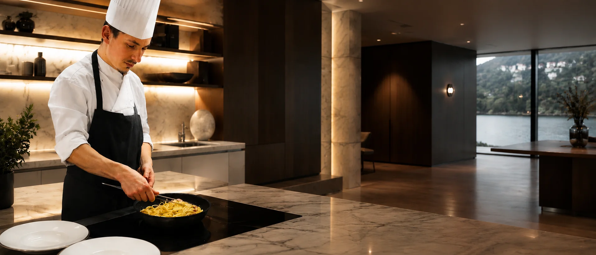

# Audit SEO — chefyuriypustovit.com
**Analista:** Senior SEO Specialist (Technical SEO · Semantic SEO · EEAT · Local SEO)
**Data audit:** 06/08/2026
**Perimetro analizzato:** `index.html`, 7 pagine `/esperienze/*.html`, `assets/css/main.css`, `assets/js/main.js`, `robots.txt`, `sitemap.xml`, tutti gli asset immagine/video, JSON-LD, meta tag, Open Graph, struttura di navigazione, link interni.

---

# SEO SCORE GENERALE

## **42 / 100**

Il sito ha **fondamenta tecniche pulite** (HTML valido, mobile-first, canonical corretti, sitemap/robots presenti, copy editoriale di qualità, nessun contenuto fake come testimonianze finte) ma **non è ancora ottimizzato per posizionarsi** sulle query che contano davvero: *"Chef Privato"*, *"Chef a domicilio"* e soprattutto le varianti locali (*Viterbo, Lazio, Roma, Umbria, Toscana*).

Motivazione sintetica del punteggio:

| Area | Voto | Perché |
|---|---|---|
| Tecnica (performance, markup, crawlability) | 45/100 | Tailwind via CDN in produzione, nessun lazy-loading, PNG da 2-2.7MB, hero LCP non preloadato, link interni rotti verso `#testimonianze` |
| On-page / semantica | 50/100 | Copy emotivo e ben scritto ma H1/H2/meta quasi mai contengono le keyword primarie ("Chef Privato" compare 1 sola volta in tutto il body visibile del sito) |
| Local SEO | 15/100 | "Lazio, Tuscia, Toscana e Umbria" citati **solo 2 volte, solo nell'hero della home**. "Viterbo" 1 sola occorrenza in tutto il sito. "Roma" **zero occorrenze reali** (i match trovati erano falsi positivi di "romantic-a/o"). Nessuna pagina città, nessun local business schema con area geografica dettagliata |
| Structured Data | 35/100 | Solo `Service`/`FoodEstablishment` minimali. Mancano Person, LocalBusiness, FAQPage, BreadcrumbList, ImageObject, WebSite/SearchAction |
| EEAT | 40/100 | Buon segnale di esperienza (12 anni), ma zero prove verificabili: nessun volto del cuoco, nessuna credenziale, nessuna recensione reale, nessuna privacy policy |
| Content/Blog | 0/100 | Blog assente: zero copertura per query informazionali ad alto volume ("quanto costa uno chef privato", "cosa fa un personal chef", ecc.) |

Il sito **non è penalizzato**, è semplicemente **invisibile** per la maggior parte delle query target elencate nel brief: oggi può competere solo su query di brand ("Chef Yuri") o su query molto generiche su "personal chef", ma non su "chef privato Viterbo", "chef a domicilio Lazio", "private chef Tuscany", ecc.

---

# SEO TECNICA

## 🔴 Problema 1 — Tailwind CSS caricato via CDN in produzione (CRITICO)

```html
<script src="https://cdn.tailwindcss.com"></script>
<script>tailwind.config = {...}</script>
```
Presente identico in **tutte e 8 le pagine**.

**Perché è un problema serio:** il Play CDN di Tailwind non è pensato per la produzione. Genera il CSS **a runtime nel browser**, tramite un motore JIT in JavaScript, invece di servire un file `.css` statico e minificato. Conseguenze dirette:
- Script render-blocking in `<head>`, eseguito prima che la pagina possa essere disegnata
- Flash of Unstyled Content (FOUC) e possibile Cumulative Layout Shift
- Peggiora Largest Contentful Paint e Interaction to Next Paint su ogni pagina del sito
- Google usa Core Web Vitals come fattore di ranking diretto (page experience signal): questo singolo problema penalizza **tutte e 8 le pagine contemporaneamente**

**Priorità:** Alta. **Come correggere:** sostituire con Tailwind CLI o build step (Vite/PostCSS) che generi un `assets/css/tailwind.css` statico, purge-ato (solo le classi realmente usate), da linkare come `<link rel="stylesheet">` accanto a `main.css`. Elimina lo script CDN da tutte le pagine.

## 🔴 Problema 2 — Hero image (LCP) non preloadata, mentre immagini below-the-fold sì

In `index.html`, righe 23-29, vengono precaricate le **6 foto del carosello galleria** (sezione 5, molto sotto il fold):
```html
<link rel="preload" as="image" href="assets/img/galleria-mise-en-place.webp">
... (altre 5)
```
Ma l'immagine hero (`hero-chef-privato.webp`), che è quasi certamente l'elemento LCP reale della pagina (prima cosa visibile, piena viewport), **non ha alcun preload né `fetchpriority="high"`**.

**Perché è un problema:** questo inverte le priorità di caricamento: il browser dà priorità a 6 immagini che l'utente vedrà solo se scrolla fino in fondo, mentre l'immagine che determina il punteggio LCP compete con Tailwind CDN, Google Fonts e il resto del CSS.

**Come correggere:**
```html
<link rel="preload" as="image" href="assets/img/hero-chef-privato.webp" fetchpriority="high">
```
e sull'`` stesso aggiungere `fetchpriority="high"`. Ridimensionare o rimuovere il preload delle 6 immagini galleria (o mantenerlo ma con priorità più bassa, es. `as="image"` senza `fetchpriority`).

## 🔴 Problema 3 — Immagini PNG non compresse, fino a 2.7MB

| File | Peso | Usato in |
|---|---|---|
| `esperienza-cooking-class.png` | 2.74 MB | Home + `cooking-class.html` |
| `esperienza-cena-privata.png` | 2.25 MB | Home + `cena-privata.html` + link interni in 4 pagine |
| `galleria-tavola-apparecchiata.png` | 2.24 MB | Carosello galleria home |
| `chi-sono.png` | 1.99 MB | Poster video sezione "Chi sono" |
| `galleria-piatto-signature.png` | 1.77 MB | Carosello galleria home |
| `hero.png` | 1.77 MB | **Non referenziato in nessun file** (orfano) |
| `signature.png` | 321 KB | Logo/firma, usato più volte |

Queste immagini sono in formato PNG mentre il resto del sito usa correttamente WebP (100-260KB). Sono tra le immagini **più visibili del sito** (card principale "Esperienze", poster del video hero della sezione "Chi sono", due immagini del carosello galleria) — cioè esattamente quelle con più impatto su LCP.

**Come correggere:** convertire tutte in WebP qualità 75-80 (risparmio atteso 85-92%, es. 2.7MB → ~200-300KB). Comando esempio:
```bash
cwebp -q 80 esperienza-cooking-class.png -o esperienza-cooking-class.webp
```
Aggiornare i riferimenti `src` in `index.html` ed `esperienze/cooking-class.html`.

## 🟠 Problema 4 — Nessun `loading="lazy"` su nessuna immagine del sito

Verificato con grep su tutte le 8 pagine: **zero occorrenze** di `loading="lazy"`. Ogni immagine (comprese quelle nelle sezioni "Altre esperienze" a fondo pagina, sempre below-the-fold) viene richiesta dal browser con priorità normale fin da subito.

**Come correggere:** aggiungere `loading="lazy"` a tutte le `` **tranne** l'hero (che deve restare eager/high-priority). Esempio per le card "Altre esperienze":
```html

```

## 🟠 Problema 5 — Link interni rotti verso `#testimonianze` in tutte e 7 le pagine Esperienze

La sezione "Testimonianze" è stata **rimossa dalla home il 25/07/2026** (confermato in `CONTENUTI-DA-COMPLETARE.md` e verificato: `index.html` non contiene più `id="testimonianze"`). Tuttavia **tutte e 7 le pagine `/esperienze/*.html`** contengono ancora, sia nel nav desktop che nel menu mobile che nel footer:
```html
<a href="../index.html#testimonianze" class="link-underline pb-1 text-ink">Testimonianze</a>
```
Sono **21 link rotti** (3 per pagina × 7 pagine) che puntano a un'ancora inesistente. Non è un errore 404 (la pagina esiste), ma è un link morto dal punto di vista dell'utente e un segnale di manutenzione trascurata — oltre a essere disallineato dalla home, che ha già aggiornato il proprio menu con "Come funziona" e "La serata" al posto di "Testimonianze".

**Come correggere:** in tutte le 7 pagine esperienze, sostituire i 3 riferimenti a `#testimonianze` con le voci di menu correnti della home (`#come-funziona`, `#come-si-svolge`), replicando esattamente il nuovo menu di `index.html`.

## 🟡 Problema 6 — Alt text e aria-label in stile "slug" innaturale

```html

...
<video ... aria-label="chef-privato-viterbo-impiattamento" ...>
```
Questi due attributi sembrano un tentativo di keyword stuffing fatto in modo tecnicamente inefficace: gli alt-text con trattini al posto degli spazi **non vengono premiati da Google** (che li legge come testo naturale, non come slug) e **peggiorano l'accessibilità reale** per chi usa uno screen reader, perché "chef-privato-Yuriy Pustovit" letto ad alta voce è innaturale. L'`aria-label` di un video, inoltre, non ha alcun valore SEO diretto (non è indicizzato come i tag immagine) — è solo un problema di accessibilità.

**Come correggere:**
```html
alt="Firma di Yuriy Pustovit, chef privato"
aria-label="Video: chef privato prepara e impiatta una tartare in una cucina a Viterbo"
```

## 🟢 Cose fatte bene (da preservare)

- `lang="it"` corretto, `charset UTF-8`, `viewport` corretto su tutte le pagine
- Canonical self-referenziante e coerente su ogni pagina (incluso aggiornamento recente al dominio corretto)
- `robots.txt` minimale e corretto, con riferimento a sitemap
- `sitemap.xml` copre tutte le 8 URL reali del sito, nessuna URL orfana o extra
- Font con `&display=swap` già impostato (mitiga il blocco da Google Fonts)
- `prefers-reduced-motion` rispettato ovunque nel CSS — buona pratica di accessibilità
- Form di prenotazione con validazione nativa **e** submit AJAX via Formspree (nessun reload, buona UX)
- Nessuna sezione "Testimonianze"/statistiche finte lasciata online: scelta eticamente ed EEAT-correttamente cauta (evita il rischio penalizzazione per contenuti ingannevoli)

---

# SEO ON PAGE

## `index.html` (Home)

- **Keyword principale:** nessuna keyword primaria chiara — il title usa "Personal Chef", non "Chef Privato"
- **Keyword secondarie presenti:** cena privata, chef in villa, cooking class, eventi esclusivi
- **Intento di ricerca servito:** navigazionale/brand + un po' transazionale, ma non intercetta query locali
- **Meta Title (60 caratteri):** `Chef Yuri — Personal Chef | Esperienze gastronomiche private`
- **Meta Description (158 caratteri):** `Chef Yuri porta la cucina d'autore nella privacy di casa vostra: cene private, chef in villa, cooking class, eventi esclusivi. Un'esperienza, non un servizio.`
- **H1:** `Ogni cena nasce per una sola tavola. La tua.` — bellissimo dal punto di vista brand, **zero valore SEO**: non contiene "chef privato", "personal chef" né alcuna keyword target
- **H2 (7):** Dodici anni nelle cucine professionali... / Sette modi di vivere l'esperienza / Quattro passaggi, nessuna complicazione / Una selezione, non un archivio / Sette passaggi, una sola serata / Raccontami la tua occasione / La prossima esperienza potrebbe iniziare dalla tua tavola — **nessuno contiene keyword target**
- **H3 (11):** i 7 titoli delle card esperienze (Cena Privata, Chef in Villa, ecc.) + "Non trovi l'esperienza che stai cercando?" + 4 step "Come funziona" — questi H3 **sì** contengono keyword di servizio, ma sono H3, non H1/H2
- **Keyword mancanti:** "Chef Privato" (letterale, in H1/title/meta), "Viterbo", "Roma", "Umbria", "Toscana" fuori dall'eyebrow, "chef a domicilio"
- **Keyword sovrautilizzate:** nessuna (anzi, sotto-utilizzo)
- **Keyword duplicate:** nessuna cannibalizzazione interna rilevata
- **Errori SEO:** H1 non ottimizzato; local keyword confinate a un unico paragrafo dell'hero; JSON-LD tipo `FoodEstablishment` discutibile (vedi sezione Structured Data)
- **Opportunità:** aggiungere un H2 keyword-ricco subito dopo l'hero (es. "Chef privato a domicilio in Lazio, Viterbo, Umbria e Toscana"); arricchire meta description con località

## `esperienze/cena-privata.html`

- **Keyword principale:** "Cena Privata a Domicilio" — buona corrispondenza con "Cena Privata" del brief
- **Keyword secondarie:** personal chef (×2)
- **Intento:** transazionale/commerciale, ben servito
- **Meta Title (52 char):** `Cena Privata a Domicilio | Chef Yuri — Personal Chef`
- **Meta Description (150 char):** presente, descrittiva, manca location
- **H1:** `Cena Privata` — corretto e conciso ma senza qualificatore locale
- **H2 (3):** Come si svolge / Per chi è pensata / Cosa è incluso — generici, **stesso identico H2 template ripetuto su tutte le 7 pagine esperienze** (vedi cannibalizzazione sotto)
- **H3:** nessuno
- **Keyword mancanti:** "chef privato" (0 occorrenze nel body — solo "personal chef"), nessun riferimento geografico
- **Keyword sovrautilizzate:** nessuna
- **Keyword duplicate:** gli H2 "Come si svolge / Per chi è pensata / Cosa è incluso" sono **identici parola per parola** su 5 delle 7 pagine esperienze → rischio di **keyword/struttura cannibalization** leggera: Google può avere difficoltà a differenziare semanticamente le pagine solo dagli H2
- **Errori SEO:** manca variazione semantica negli H2
- **Opportunità:** H2 personalizzati per pagina, es. "Come si svolge una cena privata a domicilio"

## `esperienze/chef-in-villa.html`

- **Keyword principale:** "Chef in Villa" — corrisponde bene a "Chef per villa" del brief
- **Meta Title (41 char):** `Chef in Villa | Chef Yuri — Personal Chef` — **il più corto del sito**, spazio SERP inutilizzato (60 char disponibili, ne usa 41)
- **H1:** `Chef in Villa`
- **Keyword presenti nel body:** "chef a domicilio" (1×), "chef privato" (4×) — **la pagina meglio ottimizzata del sito per "chef privato"**
- **Keyword mancanti:** nessuna città/regione specifica nel body (parla di "villa" in astratto, mai "villa in Umbria" o "villa in Toscana", che sono query reali ad alto valore)
- **Errori SEO:** title troppo corto, spreca opportunità di aggiungere "Toscana", "Umbria" nei 19 caratteri liberi
- **Opportunità:** `Chef in Villa in Toscana e Umbria | Chef Yuri — Personal Chef` (63 char, ancora accettabile)

## `esperienze/cooking-class.html`

- **Keyword principale:** "Cooking Class Privata"
- **H1:** `Cooking Class`
- **Keyword mancanti:** **"chef privato" non compare mai (0 occorrenze)**, "chef a domicilio" mai, nessuna geo-keyword
- **Errori SEO:** è la pagina più debole per copertura del set di keyword primarie del brief — si affida solo a "personal chef" (2×)
- **Opportunità:** aggiungere un paragrafo che collega esplicitamente "cooking class con personal chef a domicilio in Lazio e Umbria"

## `esperienze/eventi-aziendali.html`

- **Keyword principale:** "Chef Privato per Eventi Aziendali" — ottimo match, il **title migliore del sito** per contenere letteralmente "Chef Privato"
- **H1:** `Eventi Aziendali`
- **H2 (3, ordine invertito rispetto alle altre pagine):** Per chi è pensata / Come si svolge / Cosa è incluso
- **Keyword presenti:** "chef privato" (3×)
- **Errori SEO:** l'H1 da solo ("Eventi Aziendali") non contiene "chef privato" nonostante il title sì — incoerenza title/H1 minore
- **Opportunità:** H1 → "Chef Privato per Eventi Aziendali" identico al title, rinforza la corrispondenza semantica

## `esperienze/proposta-di-matrimonio.html`

- **Keyword principale:** "Cena Privata per Proposte di Matrimonio" — buon match con "Chef per matrimonio intimo"
- **Title (67 char):** leggermente sopra la soglia sicura di 60, rischio troncamento su mobile
- **H1:** `Proposte di Matrimonio`
- **Keyword mancanti:** "chef privato" (0 occorrenze), "chef a domicilio" (0), nessuna geo-keyword
- **Errori SEO:** title lungo + zero copertura "chef privato"
- **Opportunità:** accorciare title a `Proposta di Matrimonio a Cena Privata | Chef Yuri` (52 char) lasciando margine per un futuro `| Lazio`

## `esperienze/compleanni.html`

- **Keyword principale:** "Chef Privato per Compleanni" — buon match
- **H1:** `Compleanni` (da solo, non ripete "chef privato" come il title)
- **Keyword presenti:** "chef privato" (4×), "chef a domicilio" (1×) — **seconda pagina meglio ottimizzata**
- **Errori SEO:** stesso disallineamento title/H1 già visto in eventi-aziendali

## `esperienze/anniversari.html`

- **Keyword principale:** "Chef Privato per Anniversari"
- **H1:** `Anniversari`
- **Keyword presenti:** "chef privato" (3×)
- **Errori SEO:** stesso pattern title/H1 disallineato

### Pattern trasversale su tutte e 7 le pagine Esperienze
Il **title tag contiene quasi sempre "Chef Privato" o "Personal Chef"**, ma **l'H1 non lo ripete mai** — è sempre solo il nome dell'esperienza ("Compleanni", "Anniversari", "Chef in Villa"...). Google dà molto peso alla coerenza semantica title↔H1↔primo paragrafo: separare completamente il brand/keyword (nel title) dal contenuto (nell'H1) è un'occasione persa a costo zero.

---

# LOCAL SEO

**Situazione reale (verificata riga per riga, non assunta):**

- **"Lazio"**: 2 occorrenze totali sull'intero sito, **entrambe nella stessa frase** dell'hero della home ("Personal Chef · Lazio, Tuscia, Toscana e Umbria" / "...tra Lazio, Tuscia, Toscana e Umbria..."). Zero occorrenze in tutte le 7 pagine Esperienze.
- **"Viterbo"**: **1 sola occorrenza in tutto il sito** (nell'`aria-label` innaturale del video, che oltretutto non ha valore SEO — vedi Problema 6). Zero volte come testo leggibile in un H1, H2, paragrafo o meta tag.
- **"Roma"**: **0 occorrenze reali**. I match iniziali trovati dal grep erano falsi positivi (sottostringa di "romantica"/"romantico" negli alt-text delle foto). Il nome della capitale, probabilmente il mercato con più volume di ricerca dell'intera area servita, **non compare mai**.
- **"Umbria"**: 2 occorrenze, stesso paragrafo hero della home.
- **"Toscana"**: 2 occorrenze, stesso paragrafo hero della home.
- **"Tuscia"**: 2 occorrenze, stesso paragrafo hero della home.

**Conclusione:** tutte le keyword geografiche del sito sono concentrate in **un'unica frase, in un'unica sezione, di un'unica pagina** (l'hero della home). Semanticamente, questo non basta a Google per associare con forza il dominio a query locali: non c'è ridondanza naturale del segnale geografico nei title, nelle meta description, negli H2, nello structured data (`areaServed: "IT"` è generico, non elenca le regioni/città), né in pagine dedicate.

## Cosa manca (in ordine di impatto)

1. **Nessuna pagina/sezione dedicata per città o regione.** Chi cerca "chef privato Viterbo" oggi non ha una pagina che risponda con precisione a quell'intento — arriva sulla home, che menziona Viterbo zero volte in modo leggibile.
2. **`areaServed` nello structured data è generico ("IT")** invece di elencare `Lazio`, `Umbria`, `Toscana`, `Viterbo`, `Roma` come `AdministrativeArea`/`City`.
3. **Nessun NAP (Name-Address-Phone) coerente** in nessuna pagina — anche solo indicare "Servizio attivo in provincia di Viterbo e zone limitrofe" nel footer aiuterebbe.
4. **Nessun riferimento geografico nei meta title/description** di nessuna delle 8 pagine — occasione persa enorme per lo snippet SERP, che è spesso il primo posto dove un utente locale decide se cliccare.
5. **Nessuna menzione di Google Business Profile / mappa embed** — cruciale per Local Pack, non verificabile da codice ma da segnalare come azione esterna prioritaria.
6. Il local SEO **non deve essere forzato in modo innaturale** (come richiesto nel brief) — la soluzione corretta non è ripetere "Viterbo" ovunque, ma:
   - una riga contestuale per pagina (es. "disponibile per cene private in tutta la provincia di Viterbo e nel Lazio settentrionale")
   - varianti naturali nei meta tag
   - eventualmente 2-3 pagine dedicate per macro-area (Lazio/Tuscia, Umbria, Toscana) se il volume di ricerca lo giustifica

---

# EEAT

## Experience (Esperienza) — Parziale ✅⚠️
- ✅ "Dodici anni nelle cucine professionali" comunicato con forza nell'H2 della sezione Chi Sono
- ⚠️ Nessun dettaglio verificabile: quali ristoranti, quale ruolo (chef de partie? sous chef? executive?), quale città/paese
- ⚠️ **Nessuna foto del volto dello chef** — scelta esplicitamente confermata in `CONTENUTI-DA-COMPLETARE.md` ("foto di dettaglio/impiattamento, non un ritratto in volto"). Dal punto di vista EEAT questo è un limite reale: mostrare la persona reale dietro un servizio "privato"/fiduciario (si entra in casa dei clienti) è uno dei segnali di fiducia più forti che un utente — e Google — può percepire

## Expertise (Competenza) — Debole ❌
- ❌ Nessun contenuto che dimostri competenza tecnica in modo verificabile: niente blog, niente spiegazioni di tecnica, niente esempio di menu degustazione reale, niente foto/nome di piatti signature con dettaglio tecnico
- ❌ Nessuna menzione di formazione, scuola alberghiera, certificazioni (es. HACCP, corsi professionali)

## Authoritativeness (Autorevolezza) — Molto debole ❌
- ❌ Nessuna recensione reale (scelta corretta eticamente, ma lascia un vuoto)
- ❌ Nessuna rassegna stampa, menzione, collaborazione con altri professionisti del settore
- ❌ Nessun profilo social collegato oltre a Instagram (link presente ma non verificato/non ricco di contenuti secondo `CONTENUTI-DA-COMPLETARE.md`)
- ❌ Nessuna menzione di associazioni di categoria (es. FIC — Federazione Italiana Cuochi)
- ❌ Nessun `Person` schema che colleghi l'identità digitale (sito, Instagram, eventuali altri profili) in un unico entity graph riconoscibile da Google

## Trustworthiness (Affidabilità) — Parziale ⚠️
- ✅ Contatti reali e diretti (WhatsApp verificato, email reale)
- ✅ Nessun contenuto ingannevole (niente statistiche inventate, niente recensioni finte)
- ❌ **Nessuna Privacy Policy / Cookie Policy** in nessuna pagina del sito, nonostante ci sia un form che raccolga nome, email, numero di ospiti, data evento e (opzionalmente) telefono, inviato a un servizio terzo (Formspree). Per un sito che opera in UE, questa è un'assenza rilevante sia per fiducia utente sia per conformità GDPR
- ❌ Nessuna pagina "Termini di servizio" o policy di cancellazione/caparra, utile per un servizio di questo valore economico

**Cosa manca in sintesi (in ordine di priorità):**
1. Privacy Policy (compliance + trust — quick win legale)
2. `Person` schema strutturato per Yuriy Pustovit con `sameAs` verso i social
3. Una vera pagina "Chi sono" estesa (oggi è solo una sezione emotiva nella home, non una pagina indicizzabile a sé) con percorso professionale verificabile
4. Almeno una foto reale del volto dello chef (decisione del cliente, non tecnica, ma da segnalare con forza)
5. Certificazioni/formazione menzionate esplicitamente se esistenti

---

# STRUCTURED DATA

## Cosa c'è oggi

**Home (`index.html`):**
```json
{
  "@context": "https://schema.org",
  "@type": "FoodEstablishment",
  "name": "Chef Yuri — Personal Chef",
  "description": "...",
  "url": "https://chefyuriypustovit.com/",
  "areaServed": "IT",
  "priceRange": "$$$$"
}
```
**Problema:** `FoodEstablishment` è un sottotipo pensato per attività con una sede fisica dove i clienti si recano (ristoranti, gastronomie). Chef Yuri **non ha un locale**, lavora a domicilio del cliente: usare `FoodEstablishment` è semanticamente scorretto e rischia di generare risultati rich inutili o fuorvianti (es. Google potrebbe aspettarsi orari di apertura di un locale fisico). Il tipo corretto è `ProfessionalService` (o `LocalBusiness` generico con `makesOffer`), eventualmente affiancato da `Person` per il professionista.

**Pagine Esperienze (tutte e 7):**
```json
{
  "@context": "https://schema.org",
  "@type": "Service",
  "serviceType": "...",
  "name": "... — Chef Yuri",
  "description": "...",
  "provider": { "@type": "Person", "name": "Chef Yuri" },
  "areaServed": "IT"
}
```
Corretto come impostazione di base, ma minimale: `provider` cita solo `name`, senza collegare l'entità Person completa (che dovrebbe vivere una volta sola, sulla home o su una pagina `/chi-sono`, e essere referenziata via `@id` dalle altre pagine).

## Cosa manca

- **Person** (entità unica, riusata via `@id` in tutte le pagine)
- **LocalBusiness/ProfessionalService** con `areaServed` dettagliato (Lazio, Umbria, Toscana, Viterbo, Roma)
- **BreadcrumbList** (il breadcrumb testuale "Esperienze / Cena Privata" esiste già visivamente in ogni pagina esperienza ma non è marcato come dato strutturato)
- **FAQPage** (nessuna sezione FAQ esiste ancora nel sito — vedi Opportunità)
- **ImageObject** per le foto principali (utile per Google Images / rich snippet)
- **WebSite** con `SearchAction` (facoltativo, dato che non c'è una search interna)
- **Review/AggregateRating**: giustamente assente finché non ci sono recensioni reali — **non aggiungere finché non verificabile**, come già annotato correttamente nel commento HTML esistente

## Codice proposto — `Person` (da inserire una volta, referenziato ovunque)

```json
{
  "@context": "https://schema.org",
  "@type": "Person",
  "@id": "https://chefyuriypustovit.com/#person",
  "name": "Yuriy Pustovit",
  "alternateName": "Chef Yuri",
  "jobTitle": "Personal Chef / Chef Privato",
  "description": "Chef privato con oltre 12 anni di esperienza nella ristorazione professionale, specializzato in cene private, chef in villa ed eventi esclusivi tra Lazio, Tuscia, Umbria e Toscana.",
  "url": "https://chefyuriypustovit.com/",
  "image": "https://chefyuriypustovit.com/assets/img/chi-sono.png",
  "sameAs": [
    "https://instagram.com/chefyuri"
  ],
  "worksFor": { "@id": "https://chefyuriypustovit.com/#business" }
}
```

## Codice proposto — `ProfessionalService` (sostituisce `FoodEstablishment` in home)

```json
{
  "@context": "https://schema.org",
  "@type": "ProfessionalService",
  "@id": "https://chefyuriypustovit.com/#business",
  "name": "Chef Yuri — Personal Chef",
  "description": "Servizio di chef privato a domicilio per cene private, chef in villa, cooking class ed eventi esclusivi.",
  "url": "https://chefyuriypustovit.com/",
  "image": "https://chefyuriypustovit.com/assets/img/hero-chef-privato.webp",
  "priceRange": "€€€€",
  "areaServed": [
    { "@type": "AdministrativeArea", "name": "Lazio" },
    { "@type": "AdministrativeArea", "name": "Umbria" },
    { "@type": "AdministrativeArea", "name": "Toscana" },
    { "@type": "City", "name": "Viterbo" },
    { "@type": "City", "name": "Roma" }
  ],
  "employee": { "@id": "https://chefyuriypustovit.com/#person" },
  "sameAs": ["https://instagram.com/chefyuri"]
}
```

## Codice proposto — `BreadcrumbList` (da aggiungere a ogni pagina Esperienza)

```json
{
  "@context": "https://schema.org",
  "@type": "BreadcrumbList",
  "itemListElement": [
    { "@type": "ListItem", "position": 1, "name": "Home", "item": "https://chefyuriypustovit.com/" },
    { "@type": "ListItem", "position": 2, "name": "Esperienze", "item": "https://chefyuriypustovit.com/#esperienze" },
    { "@type": "ListItem", "position": 3, "name": "Cena Privata", "item": "https://chefyuriypustovit.com/esperienze/cena-privata.html" }
  ]
}
```
(adattare `name`/`item` per ciascuna delle 7 pagine)

## Codice proposto — `FAQPage` (da abbinare a una nuova sezione FAQ, vedi Opportunità)

```json
{
  "@context": "https://schema.org",
  "@type": "FAQPage",
  "mainEntity": [
    {
      "@type": "Question",
      "name": "Quanto costa uno chef privato a domicilio?",
      "acceptedAnswer": {
        "@type": "Answer",
        "text": "Il costo varia in base al numero di ospiti, al menù scelto e alla durata del servizio. Scrivimi con i dettagli della tua occasione per ricevere un preventivo su misura."
      }
    },
    {
      "@type": "Question",
      "name": "In quali zone lavora Chef Yuri?",
      "acceptedAnswer": {
        "@type": "Answer",
        "text": "Il servizio è disponibile principalmente nel Lazio (provincia di Viterbo e area di Roma), in Umbria e in Toscana, con disponibilità anche fuori regione su richiesta."
      }
    }
  ]
}
```

---

# IMMAGINI

| Controllo | Esito | Dettaglio |
|---|---|---|
| `alt` presente | ✅ Sì, su tutte le immagini | Testi descrittivi e in italiano naturale, buona qualità (eccetto i 2 casi "slug" segnalati nel Problema 6) |
| `alt` con keyword | ⚠️ Parziale | Nessun alt contiene "chef privato" o la città — occasione persa su alcune immagini chiave (hero, gallery) |
| `title` attribute | ❌ Assente | Non necessario per SEO (Google non lo usa più come prima), nessuna azione richiesta |
| filename descrittivi | ✅ Buono | `esperienza-cena-privata.png`, `galleria-piatto-signature.png` — nomi già semanticamente corretti |
| filename con keyword geografiche | ❌ Assente | Nessun file si chiama es. `chef-privato-viterbo.webp` |
| dimensioni/compressione | 🔴 Critico | Vedi Problema 3 — 7 immagini tra 1.7 e 2.7MB |
| `loading="lazy"` | 🔴 Assente ovunque | Vedi Problema 4 |
| `width`/`height` espliciti | ❌ Assenti su tutte le `` | Mitigato in parte da classi Tailwind `aspect-[...]` sui container, ma non è una garanzia CLS completa quanto attributi espliciti |
| immagini orfane (non referenziate) | ⚠️ 7 file trovati | `hero.png`, `galleria-dolce.webp`, `galleria-ingredienti-di-stagione.webp`, `galleria-momento-conviviale.png`, `galleria-relazione.webp`, `galleria-servizio-in-villa.webp`, `signature-chef-yuri.png` — non pesano sul caricamento (non richiesti dal browser) ma sono ~7MB di asset morti nel repository, da valutare se riutilizzare (sembrano scarti di una galleria precedente) o rimuovere |

---

# PERFORMANCE SEO

| Metrica | Stato stimato | Causa principale |
|---|---|---|
| **LCP** (Largest Contentful Paint) | 🔴 A rischio | Tailwind CDN render-blocking + hero image non preloadata + Google Fonts render-blocking |
| **CLS** (Cumulative Layout Shift) | 🟡 Probabilmente accettabile | Container con `aspect-ratio` via Tailwind mitigano, ma mancano `width`/`height` espliciti come rete di sicurezza; il caricamento tardivo del CSS via CDN Tailwind è il rischio maggiore (stili applicati dopo il primo paint) |
| **INP** (Interaction to Next Paint) | 🟡 Rischio medio | Lo script Tailwind CDN esegue parsing/JIT nel main thread all'avvio; il resto del JS (`main.js`) è leggero e ben scritto (event listener passivi, `IntersectionObserver`, nessun layout thrashing evidente) |
| Render blocking | 🔴 Sì | `cdn.tailwindcss.com` (script sync in head) + foglio Google Fonts (mitigato da preconnect ma non da preload/font-display asincrono aggiuntivo) |
| Font loading | 🟡 Buono ma migliorabile | `&display=swap` già presente (ottimo), `preconnect` già presente per googleapis/gstatic |
| Preload | 🔴 Mal prioritizzato | Vedi Problema 2 |
| Prefetch | ❌ Assente | Nessun `rel="prefetch"` per le pagine Esperienze linkate dalla griglia home — con 7 pagine leggere sarebbe un miglioramento a basso sforzo per la navigazione percepita |
| Caching | ⚠️ Non verificabile da codice | Dipende dalla configurazione del server/hosting (non presente nel repo alcun file `.htaccess`/header di cache) — da verificare in produzione |
| Video | 🟡 Da ottimizzare | `chi-sono-impiattamento.mp4` (4MB) ha `preload="auto"`: forza il download immediato non appena la sezione è nel DOM (non solo quando visibile). Consigliato `preload="metadata"` + avvio play via `IntersectionObserver` quando la sezione entra in viewport |

---

# INTERNAL LINKING

- **Struttura:** Home → 7 pagine Esperienze (link diretti dalla griglia "Esperienze", anchor text = nome esperienza, ottimo per SEO) → ogni pagina Esperienza rilinka 3 esperienze correlate + 1-2 link contestuali nel corpo del testo (es. `cena-privata.html` → `eventi-aziendali.html`, `chef-in-villa.html`)
- **Anchor text:** descrittivi e naturali ("Chef in Villa", "Eventi Aziendali"), mai generici tipo "clicca qui" — ✅ buona pratica
- **Orphan pages:** nessuna. Tutte le 8 URL in sitemap sono raggiungibili in 1 click dalla home
- **Link depth:** massimo 1 click dalla home per ogni pagina — ottimo, nessuna pagina "sepolta"
- **Breadcrumb testuale:** presente visivamente in ogni pagina esperienza ("Esperienze / Nome pagina") ma **non marcato come dato strutturato** (vedi Structured Data)
- **Link rotti:** 21 occorrenze di `#testimonianze` non più esistente (vedi Problema 5 — Tecnica)
- **Opportunità:** non esiste alcun link dalle pagine Esperienze verso le sezioni "Come funziona" o "Galleria" della home (solo verso `#prenotazione` e WhatsApp) — un rimando contestuale a "Come funziona" rinforzerebbe il funnel

---

# URL

| Verifica | Esito |
|---|---|
| Slug leggibili | ✅ `esperienze/cena-privata.html`, `esperienze/chef-in-villa.html` — chiari, in italiano, corrispondono al contenuto |
| Keyword nella URL | ✅ Parziale — contengono il nome dell'esperienza ma mai la geolocalizzazione (nessuna `/esperienze/cena-privata-viterbo.html` o simile, corretto non forzarla qui, ma segnalata come opportunità se si creeranno pagine città) |
| Estensione `.html` | 🟡 Non un problema SEO diretto, ma dated; nessuna azione necessaria se non si migra a un altro stack |
| URL duplicate / parametri | ✅ Nessuna trovata, nessun parametro di tracking hardcoded nei link interni |
| Maiuscole/minuscole | ✅ Tutto minuscolo, coerente |
| Trailing slash / www vs non-www | ⚠️ Non verificabile da codice (dipende da config server) — verificare che `chefyuriypustovit.com` e `www.chefyuriypustovit.com` non servano entrambi contenuto senza redirect 301 verso l'unica versione canonica |

---

# BLOG

**Stato attuale: il blog non esiste.** Zero file, zero sezione, zero riferimento in sitemap o nav.

Questo è probabilmente **la più grande opportunità di traffico organico non sfruttata** del sito: tutte le query ad intento transazionale (title/meta) sono già coperte in qualche misura dalle 7 pagine Esperienze, ma **tutte le query informazionali — che generano la maggior parte del volume di ricerca su questo argomento — non hanno nessuna pagina che possa intercettarle.**

## Proposte di articoli (con intento di ricerca e keyword target)

1. **"Quanto costa uno chef privato a domicilio? Guida ai prezzi 2026"** — intento informazionale/commerciale, altissimo volume, spesso la prima domanda di chi non ha mai usato il servizio
2. **"Chef privato vs catering: differenze, quando scegliere l'uno o l'altro"** — intercetta chi sta confrontando opzioni per un evento
3. **"Cena privata a Viterbo: le location più belle per un'esperienza gastronomica in Tuscia"** — local + esperienziale, rinforza fortemente il local SEO in modo naturale
4. **"Chef in villa in Toscana: come organizzare una settimana di vacanza senza pensare alla cucina"** — colpisce direttamente "Private Chef Tuscany" / "Chef a domicilio Toscana"
5. **"Come organizzare una proposta di matrimonio perfetta: la cornice gastronomica giusta"** — supporta la pagina `proposta-di-matrimonio.html` con contenuto correlato, ottimo per link interni
6. **"Cooking class privata: cosa aspettarsi dalla prima lezione con uno chef professionista"** — supporta `cooking-class.html`
7. **"Menù di stagione: cosa cucina uno chef privato in estate tra Lazio e Umbria"** — contenuto stagionale, rinnovabile ogni anno, ottimo per freshness signal
8. **"Eventi aziendali con chef privato: perché un'esperienza gastronomica batte il catering tradizionale"** — supporta `eventi-aziendali.html`, intento B2B
9. **"5 domande da fare a un personal chef prima di prenotare"** — trust-building, EEAT, ottimo per link building/condivisione social

Ogni articolo dovrebbe includere: 1 link interno verso la pagina Esperienza correlata, 1 menzione naturale della zona geografica servita, immagini ottimizzate in WebP con alt-text keyword-ricco, e uno schema `Article`/`BlogPosting` con `author` collegato al `Person` di Yuriy Pustovit.

---

# KEYWORD PRESENTI

| Keyword | Presente | Dove | Rilevanza |
|---|---|---|---|
| Personal Chef | ✅ | Title/meta di tutte le 8 pagine, H2 impliciti | Alta — è la keyword branding più usata sul sito |
| Chef Privato | ⚠️ Debole | Solo in JSON-LD (invisibile) + 1 frase body home + title di 4/7 pagine esperienze | Media — presente ma mai in H1, mai in meta description |
| Cena Privata / Cene Private | ✅ | Title, H1, meta description, body `cena-privata.html`, meta description home | Alta |
| Chef in Villa | ✅ | Title, H1, meta, body `chef-in-villa.html` | Alta |
| Cooking Class | ✅ | Title, H1, meta, body `cooking-class.html` | Alta |
| Chef per eventi privati | ⚠️ Parziale | Coperta semanticamente da "Eventi Aziendali" ma non come frase esatta | Media |
| Chef per compleanni | ✅ | Title `compleanni.html` ("Chef Privato per Compleanni") | Alta |
| Chef per anniversari | ✅ | Title `anniversari.html` ("Chef Privato per Anniversari") | Alta |
| Chef per matrimonio intimo | ⚠️ Parziale | Coperta da "Proposte di Matrimonio" ma frase esatta assente | Media |
| Chef a domicilio | ⚠️ Debole | Solo 2 occorrenze totali (compleanni.html, chef-in-villa.html) | Bassa — sotto-utilizzata rispetto al volume di ricerca reale in italiano |
| Cuoco a domicilio | ❌ | Mai | — |
| Chef Privato Lazio / Chef a domicilio Lazio | ❌ | "Lazio" presente solo 2× nell'hero home, mai abbinato a "chef privato" nella stessa frase indicizzabile | Bassa |
| Chef Privato Viterbo | ❌ | "Viterbo" presente 1 sola volta, in un `aria-label` non indicizzabile come contenuto testuale | Molto bassa |
| Chef Privato Roma | ❌ | "Roma" assente (0 occorrenze reali) | Nulla |
| Chef Privato Umbria / Toscana | ❌ | Solo nell'hero home, mai in title/meta/H1/H2 | Bassa |
| Private Chef / Luxury Private Chef | ❌ | Mai (il sito è interamente in italiano) | Nulla |
| Private Dining / Fine Dining a domicilio | ❌ | Mai | Nulla |

---

# KEYWORD MANCANTI

**Ordinate per priorità (impatto atteso × facilità di implementazione):**

1. **"Chef Privato" in H1 e meta description** — oggi quasi assente dai punti che contano di più per il ranking. Priorità massima, sforzo minimo.
2. **"Chef a domicilio"** — sotto-utilizzata nonostante sia probabilmente una delle query italiane più cercate nel settore; da aggiungere in almeno 4-5 pagine.
3. **Geo-keyword nei meta tag** ("Chef Privato Lazio", "Chef a domicilio Viterbo", ecc.) — assenti ovunque tranne un paragrafo dell'hero.
4. **"Roma"** — città probabilmente a più alto volume di ricerca dell'intera area servita, oggi totalmente assente.
5. **"Cuoco a domicilio"** — variante colloquiale, utile come sinonimo semantico nei testi.
6. **Espressioni luxury in inglese** ("Private Chef", "Luxury Private Chef", "Private Dining", "Fine Dining a domicilio") — rilevanti se si vuole intercettare clientela internazionale (proprietari di ville, turisti di fascia alta in Toscana/Umbria), oggi completamente assenti; richiedono probabilmente una versione o sezione in inglese, non solo l'inserimento delle parole in un testo italiano.
7. **"Chef per matrimonio intimo"** come frase esatta.
8. **"Esperienza gastronomica privata"** come frase esatta (oggi il concetto c'è ma con parole diverse).

---

# OPPORTUNITÀ SEO

1. **Creare 2-3 landing page geografiche** (es. "Chef Privato in Tuscia e Viterbo", "Personal Chef in Umbria", "Private Chef in Tuscany" in inglese) collegate dal footer e dal menu, per intercettare query locali dirette.
2. **Aggiungere una sezione FAQ** in home (con `FAQPage` schema) — copre query informazionali brevi e aumenta le probabilità di rich snippet.
3. **Lanciare il blog** (vedi sezione dedicata) — la singola azione con il maggior potenziale di traffico organico incrementale.
4. **Versione/sezione in inglese** per intercettare il segmento luxury internazionale esplicitamente menzionato nel brief (Private Chef Tuscany/Umbria/Lazio) — chi affitta ville di lusso in Toscana spesso cerca in inglese.
5. **Google Business Profile** collegato e coerente con NAP del sito (azione esterna, ma il sito deve prima avere un indirizzo/area di servizio testuale coerente da citare).
6. **Sitemap immagini** (`image:image` tag in sitemap.xml) per intercettare traffico da Google Immagini, canale particolarmente rilevante per un business fortemente visivo come questo.
7. **`lastmod` in sitemap.xml** per ogni URL, aggiornato ad ogni modifica sostanziale — aiuta il crawl scheduling.
8. **Recuperare le 7 immagini orfane** (`galleria-dolce.webp`, `galleria-relazione.webp`, ecc.) per ampliare il carosello galleria o crearne una versione estesa/pagina "Galleria" dedicata con più contenuto indicizzabile.
9. **Aggiungere Privacy Policy** — oltre alla compliance, le pagine legali con contenuto ben scritto rinforzano leggermente il segnale di trust del dominio.
10. **Twitter/X Card meta tag** (`twitter:card`, `twitter:title`, `twitter:description`, `twitter:image`) — quick win mancante su tutte le 8 pagine, utile per condivisioni social.

---

# QUICK WINS
*(realizzabili in meno di 30 minuti ciascuno)*

1. Aggiungere `loading="lazy"` a tutte le immagini below-the-fold (tutte tranne l'hero) — 8 file, find & replace sistematico
2. Aggiungere `fetchpriority="high"` e `<link rel="preload">` corretto per `hero-chef-privato.webp`, rimuovendo/derubricando il preload delle 6 immagini galleria
3. Sostituire i 21 link `#testimonianze` con `#come-funziona` nelle 7 pagine esperienze
4. Correggere i 2 alt-text/aria-label in stile slug ("chef-privato-Yuriy Pustovit" → "Firma di Yuriy Pustovit, chef privato")
5. Aggiungere `<meta name="twitter:card" content="summary_large_image">` + relativi tag su tutte le 8 pagine
6. Aggiungere `lastmod` a `sitemap.xml`
7. Uniformare H1 delle pagine Esperienze con eventi-aziendali/compleanni/anniversari per includere "Chef Privato" (es. `<h1>Chef Privato per Compleanni</h1>` invece di solo `<h1>Compleanni</h1>`)
8. Allungare il title di `chef-in-villa.html` (oggi 41 caratteri, 19 liberi) aggiungendo una qualifica geografica

---

# INTERVENTI AD ALTO IMPATTO

1. **Rimuovere Tailwind CDN e sostituirlo con build statica** — impatto diretto su Core Web Vitals su tutte le 8 pagine, quindi su ranking factor diretto e su tasso di conversione (velocità = meno abbandono).
2. **Comprimere le 7 immagini PNG pesanti in WebP** — impatto diretto su LCP delle pagine con più traffico previsto (home, cena-privata, cooking-class).
3. **Riscrivere H1/H2/meta description includendo "Chef Privato" + geo-keyword in modo naturale su tutte le 8 pagine** — impatto diretto sul matching semantico con le query target del brief.
4. **Costruire lo `areaServed` strutturato + Person schema completo** — impatto su entity recognition e Local Pack eligibility.
5. **Lanciare il blog con almeno le prime 3-4 pagine proposte** — impatto sul volume totale di query intercettabili (le pagine transazionali da sole non basteranno mai a coprire l'intent informazionale).
6. **Creare almeno 1 landing page locale dedicata a Viterbo/Tuscia** — dato che è la zona di riferimento primaria (menzionata per prima ovunque) ma con zero contenuto dedicato oggi.

---

# PIANO D'AZIONE
*(dal più al meno importante)*

### 1. Rimuovere Tailwind CDN, passare a build statica
- **Impatto SEO:** Molto alto (Core Web Vitals su tutte le pagine)
- **Difficoltà:** Media (richiede setup build tool, es. Tailwind CLI)
- **Tempo stimato:** 2-3 ore
- **File:** tutte e 8 le pagine HTML (rimuovere `<script src="https://cdn.tailwindcss.com">` e il `<script>tailwind.config...`), nuovo file `assets/css/tailwind.css` generato via build
- **Codice:**
  ```bash
  npm install -D tailwindcss
  npx tailwindcss init
  npx tailwindcss -i ./assets/css/input.css -o ./assets/css/tailwind.css --minify
  ```
  Poi in ogni HTML, sostituire lo script CDN con:
  ```html
  <link rel="stylesheet" href="assets/css/tailwind.css">
  ```

### 2. Ottimizzare e comprimere le immagini pesanti
- **Impatto SEO:** Alto (LCP)
- **Difficoltà:** Bassa
- **Tempo stimato:** 1 ora
- **File:** `assets/img/esperienza-cooking-class.png`, `esperienza-cena-privata.png`, `galleria-tavola-apparecchiata.png`, `chi-sono.png`, `galleria-piatto-signature.png` + aggiornare i riferimenti in `index.html`, `esperienze/cooking-class.html`, `esperienze/cena-privata.html`
- **Codice:**
  ```bash
  cwebp -q 80 chi-sono.png -o chi-sono.webp
  cwebp -q 80 esperienza-cena-privata.png -o esperienza-cena-privata.webp
  cwebp -q 80 esperienza-cooking-class.png -o esperienza-cooking-class.webp
  cwebp -q 80 galleria-tavola-apparecchiata.png -o galleria-tavola-apparecchiata.webp
  cwebp -q 80 galleria-piatto-signature.png -o galleria-piatto-signature.webp
  ```

### 3. Correggere priorità di caricamento LCP
- **Impatto SEO:** Alto
- **Difficoltà:** Bassa
- **Tempo stimato:** 15 minuti
- **File:** `index.html` (righe 23-29, 121)
- **Codice:**
  ```html
  <link rel="preload" as="image" href="assets/img/hero-chef-privato.webp" fetchpriority="high">
  ...
  
  ```

### 4. Riscrivere title/meta/H1 con "Chef Privato" + geo-keyword
- **Impatto SEO:** Alto
- **Difficoltà:** Bassa
- **Tempo stimato:** 1-1.5 ore per tutte le 8 pagine
- **File:** tutte le 8 pagine HTML, tag `<title>`, `<meta name="description">`, `<h1>`
- **Esempio (home):**
  ```html
  <title>Chef Privato a Domicilio | Chef Yuri — Personal Chef Lazio, Viterbo, Umbria</title>
  <meta name="description" content="Chef Yuri, chef privato a domicilio tra Lazio, Viterbo, Umbria e Toscana: cene private, chef in villa, cooking class, eventi esclusivi." />
  ```
  **Esempio (chef-in-villa.html):**
  ```html
  <title>Chef in Villa in Toscana e Umbria | Chef Yuri — Chef Privato</title>
  <h1>Chef Privato in Villa</h1>
  ```

### 5. Correggere i 21 link rotti `#testimonianze`
- **Impatto SEO:** Medio (UX + coerenza interna)
- **Difficoltà:** Bassa
- **Tempo stimato:** 20 minuti
- **File:** tutte le 7 pagine `esperienze/*.html` (nav desktop, mobile, footer)
- **Codice:** sostituire `../index.html#testimonianze` con `../index.html#come-funziona` (o rimuovere la voce se non più pertinente)

### 6. Aggiungere Person + ProfessionalService + BreadcrumbList schema
- **Impatto SEO:** Alto (entity recognition, local pack, rich result)
- **Difficoltà:** Media
- **Tempo stimato:** 1.5 ore
- **File:** `index.html` (Person + ProfessionalService), tutte le 7 pagine esperienze (BreadcrumbList)
- **Codice:** vedi sezione Structured Data sopra

### 7. Aggiungere `loading="lazy"` a tutte le immagini non-hero
- **Impatto SEO:** Medio
- **Difficoltà:** Bassa
- **Tempo stimato:** 30 minuti
- **File:** tutte le 8 pagine, tutte le `` tranne l'hero di `index.html`

### 8. Lanciare le prime 3 pagine blog
- **Impatto SEO:** Alto nel medio periodo (3-6 mesi)
- **Difficoltà:** Alta (richiede contenuto originale, struttura `/blog/`, template)
- **Tempo stimato:** 1-2 giorni per struttura + 2-3 ore per articolo
- **File:** nuova cartella `blog/`, nuove pagine `blog/quanto-costa-chef-privato.html`, ecc., aggiornamento `sitemap.xml` e nav

### 9. Creare landing page locale "Chef Privato a Viterbo e in Tuscia"
- **Impatto SEO:** Alto per query locali
- **Difficoltà:** Media
- **Tempo stimato:** 3-4 ore
- **File:** nuova pagina `esperienze/chef-privato-viterbo.html` (o `/aree-servite/viterbo.html`), aggiornamento sitemap + nav footer

### 10. Aggiungere Privacy Policy
- **Impatto SEO:** Basso diretto, alto indiretto (trust, compliance)
- **Difficoltà:** Bassa (generazione + adattamento)
- **Tempo stimato:** 1 ora
- **File:** nuova pagina `privacy.html`, link in footer di tutte le 8 pagine

---

**Nota finale da Senior SEO:** il sito ha un problema di **priorità inversa** rispetto all'obiettivo dichiarato. Il brand voice e il design sono già a un livello alto (raro per un sito di questa dimensione), ma l'ottimizzazione per "Chef Privato" + local SEO — l'obiettivo esplicito del progetto — è oggi il punto più debole. Le prime 4-5 azioni del piano (tecnica + keyword + local) porterebbero il punteggio stimato da 42 a circa 68-72/100 senza toccare una riga di design o compromettere il tono editoriale del sito.
